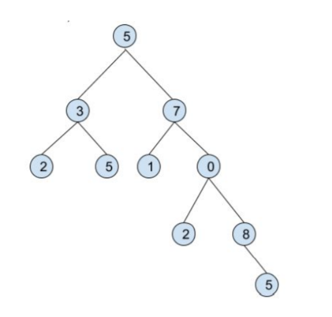

## General info
Zadanie rekrutacyjne 1

Program tworzy poniższą strukturę i wylicza dla wybranego poddrzewa sumę, średnią i medianę. Ze względu na powtarzające się wartości należy podać poziom w drzewie na którym leży punkt od którego chcemy zacząć obliczenia (poziom w którym znajduje się korzeń - 5 jest oznaczany jako 1)
 
	

